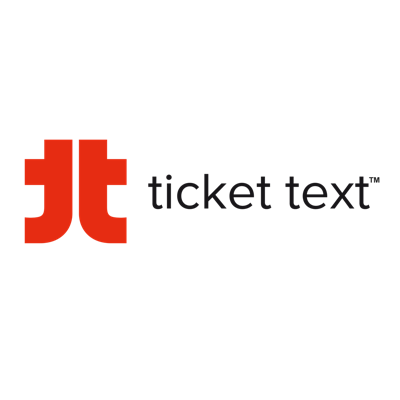
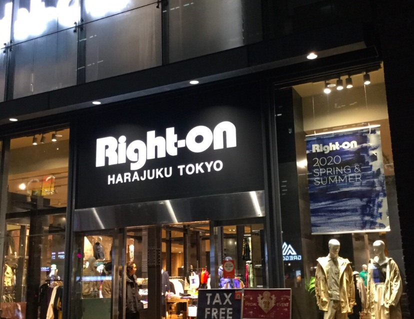

Text can be **bold**, _italic_, or ~~strikethrough~~.

[Link to another page](./another-page.html).

There should be whitespace between paragraphs.

There should be whitespace between paragraphs. We recommend including a README, or a file with information about your project.

# Ticket Text

Ticket Text is basically a platform to book online tickets for events that are organized in different places. Actively worked on designing and developing its user/Admin /Promoter portal along with integrating it with third party SeatIO which is used to provide seating plans of respective places and also admin can design their own seating plan also.
>

# Right-on

This is an e-commerce application, which is basically a japan based clothing brand and used in japan, having all features including store pick up and return/refund policy. We have also implemented world shopping so users can place orders anywhere from around the world.
>

# Technical Expertise

| Expert        | Proficient        | Competent |
|:-------------|:------------------|:------|
| JavaScript   | Git               | NodeJS  |
| Angular      | BitBucket         | Polymer  |
| React        | Bootstarp         | Wordpress   |
| Pyhton       | Asana             | 

